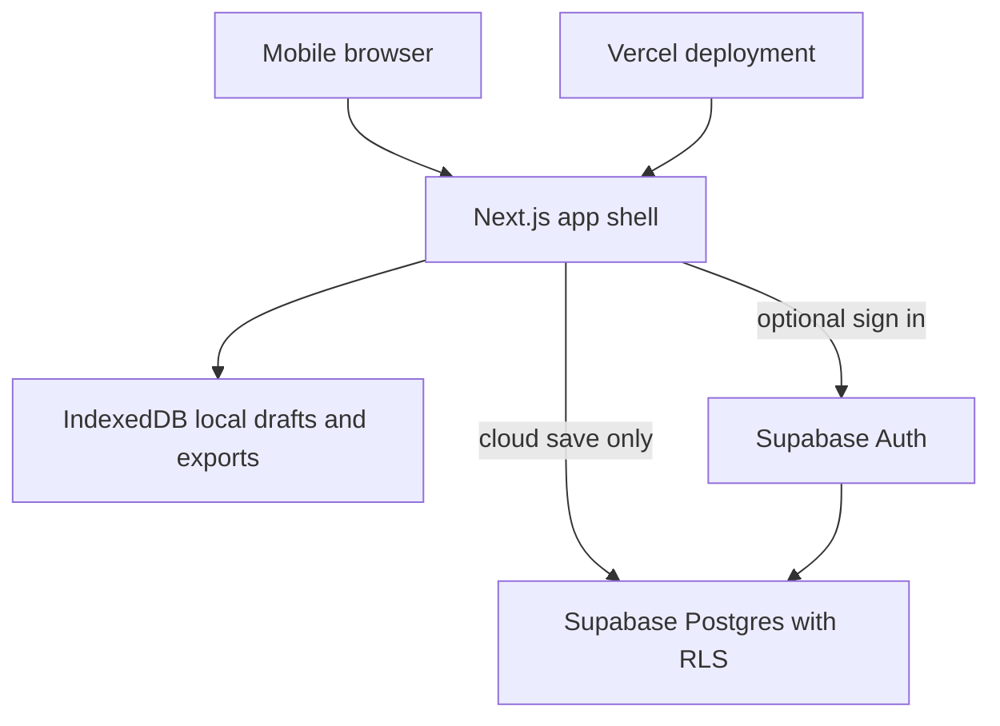

# Thought Log Standalone App - Plan

## Goal Capsule

| Field | Decision |
| --- | --- |
| Objective | Build a standalone mobile-first Thought Log app that guides a user through the CBT-style worksheet flow without AI interpretation, supports optional cloud history in Postgres, and preserves a local-only save/export path for sensitive entries. |
| Authority | The user's therapy worksheet flow and the AttuneTogether prototype feedback define product behavior; privacy and user control override convenience. |
| Execution profile | New standalone Next.js app with Supabase Auth/Postgres, Vercel deployment, GitHub repo, and a phone-testable production preview. |
| Stop conditions | Stop before adding AI interpretation, therapist/medical advice, sharing workflows, or server persistence of a local-only entry. |
| Tail ownership | LFG should produce a working deployed app, green verification, a GitHub PR or initial repo commit path, and a phone-test URL. |

---

## Product Contract

### Summary

Thought Log is a private, focused worksheet app for capturing a situation, naming feelings, writing one stream-of-consciousness thought passage, extracting thought phrases, labeling cognitive distortions one at a time, reviewing the map, and writing a realistic rational thought.
The first screen is the worksheet itself, not a landing page.
Cloud history is optional and user-owned; local-only save/export is a first-class path for entries a user does not want stored online.

### Problem Frame

Paper makes it easy to write freely, circle phrases, draw connections, and then reason from the whole page.
Digital worksheet flows often become either too clinical, too fragmented, or too eager to interpret the user.
The MVP must feel like a calm phone-native worksheet: one clear action per screen, no AI reading into the content, and no pressure to upload sensitive thoughts to a server.

### Classification

Classification: Level 4 - Guided Workflow.
The smallest useful product is a deterministic worksheet flow, not a chatbot or agent.
The local export path is a Level 1 tool inside the product.
Future AI support remains out of scope until the non-AI worksheet behavior is trusted.

### Requirements

**Worksheet Flow**

- R1. The first app experience opens to the Situation step, with a compact home icon for history and an export icon in the upper right.
- R2. The app collects situation, feelings, stream-of-consciousness thought text, extracted thought phrases, cognitive distortion labels, worksheet map review, and realistic/rational thoughts in that order.
- R3. The negative-thought capture step uses one long passage by default and does not force the user to split thoughts while writing.
- R4. The phrase-identification step lets the user highlight text, confirm the selection with a low-friction action, clear the current selection, undo the last extraction, and see the passage shrink or mark selected text as phrases are extracted.
- R5. A deterministic "auto choose thoughts" option may suggest phrase selections from grammar and punctuation, but it must never use AI interpretation and must warn before replacing manual selections.
- R6. The labeling step presents one extracted phrase at a time with concise distortion choices and definitions available without filling the screen.
- R7. The review step defaults to Original Text, then offers All Together, then One by One, so the user can review the map at multiple levels of detail.
- R8. The rational-thought step puts the writing area first and keeps the worksheet recap below it for confirmation rather than interruption.
- R9. Every screen has one visually obvious primary action without relying on extra explanatory text.

**Privacy and Persistence**

- R10. The user can complete a worksheet without saving it to the cloud.
- R11. At the end, the user can save locally, export locally, save to cloud history, or discard the entry.
- R12. Local-only entries must not be sent to Supabase, Vercel server actions, analytics, or logs as worksheet content.
- R13. Cloud-saved entries are private to the authenticated user and visible only through that user's history.
- R14. The app supports deleting a cloud entry and clearing local drafts/exports from the device.
- R15. Authentication is required for cloud history, but the worksheet capture path remains usable in private device mode.

**Standalone Product**

- R16. The app is its own GitHub repository, Vercel project, and Supabase project/database rather than an AttuneTogether module.
- R17. The app is deployable to Vercel and testable from a phone via a production or preview URL.
- R18. The data model supports future multi-user login without changing ownership semantics.
- R19. The MVP ships without AI interpretation, diagnosis, medical advice, therapist-facing workflows, payments, or social sharing.
- R20. The design is quiet, phone-native, and worksheet-focused rather than a marketing site.
- R21. User-entered worksheet content is escaped or safely rendered everywhere it appears, including review screens, history detail, and exported printable HTML.
- R22. Core controls support phone-sized touch targets, keyboard navigation, visible focus, and screen-reader labels.

### Actors

- A1. Private user: completes a worksheet and may choose local-only save/export.
- A2. Authenticated user: saves selected entries to cloud history and returns to them later.
- A3. Future invited user: may eventually create an account, but has no sharing or collaboration behavior in this MVP.

### Key Flows

- F1. Private worksheet completion
  - **Trigger:** A user opens the app without signing in.
  - **Steps:** Situation opens first; the user completes the worksheet; the app offers local save/export/discard; no worksheet content leaves the device.
  - **Outcome:** The user keeps a local file or local device draft without cloud history.
  - **Covers:** R1-R12, R15, R19-R20
- F2. Cloud history save
  - **Trigger:** A user signs in or chooses cloud save after completing a worksheet.
  - **Steps:** The app authenticates the user; confirms cloud save; inserts the entry under that user's ID; history shows the saved entry.
  - **Outcome:** The entry is retrievable from the home/history view and protected by RLS.
  - **Covers:** R11, R13-R18
- F3. Manual phrase extraction
  - **Trigger:** The user reaches phrase-identification after writing the thought passage.
  - **Steps:** The user highlights text; confirms the phrase; the original passage visually marks the selection; undo and clear remain available.
  - **Outcome:** The extracted phrase list feeds one-by-one labeling.
  - **Covers:** R3-R6
- F4. Auto phrase suggestion
  - **Trigger:** The user taps "auto choose thoughts."
  - **Steps:** If manual selections exist, the app warns that auto suggestions will replace them; the deterministic segmenter suggests phrases; the user accepts or undoes the full auto set.
  - **Outcome:** Suggested phrase selections exist without AI interpretation.
  - **Covers:** R5, R9

### Acceptance Examples

- AE1. Given a user is not signed in, when they complete a worksheet and choose local export, then no Supabase insert occurs and a local file is produced.
- AE2. Given a signed-in user saves to cloud history, when they open home/history, then only their own entries are returned.
- AE3. Given a user manually extracted three phrases, when they choose auto phrase suggestion, then a confirmation warns that the three selections will be cleared.
- AE4. Given a user labels a phrase, when they move to the next phrase, then only one phrase is the active labeling subject and definitions remain available on demand.
- AE5. Given a user reaches review, when the screen opens, then Original Text is the default review mode.

### Scope Boundaries

Deferred for later: AI interpretation, AI-generated rational thoughts, therapist sharing, encrypted sync beyond Supabase's normal transport/storage posture, payments, teams, analytics dashboards, and native mobile app wrappers.
Outside the MVP identity: diagnosis, emergency intervention, clinical claims, and any content implying the app replaces therapy.

---

## Planning Contract

### Key Technical Decisions

- KTD1. Use Next.js App Router on Vercel for the standalone app.
  This fits the requested Vercel deploy target, gives a phone-testable web app quickly, and keeps the first version shippable without native app stores.
- KTD2. Use Supabase for Auth and Postgres.
  Supabase provides managed Postgres plus auth in one project, aligns with the user's existing account, and keeps future multi-user history straightforward.
- KTD3. Treat private device mode as a first-class mode, not an auth failure state.
  The worksheet must work without account creation because the most sensitive entries are exactly the ones a user may not want online.
- KTD4. Use IndexedDB for local drafts and local-only saved entries, plus file export for durable user-controlled copies.
  Browser storage supports offline-ish device persistence, while export gives the user a file they control outside the app.
- KTD5. Store cloud entries in one owner-scoped Postgres table for MVP.
  A single `thought_logs` table with JSONB worksheet details avoids premature normalization while preserving a clean migration path.
- KTD6. Write Supabase migrations with explicit `GRANT` statements and RLS policies.
  Supabase's 2026 platform changes make Data API exposure explicit for new projects, so grants and RLS must ship together.
- KTD7. Keep phrase auto-selection deterministic and local.
  The auto feature can segment by sentence boundaries, punctuation, and conjunction heuristics, but it cannot call an LLM or upload the passage.
- KTD8. Avoid server-side logging of worksheet content.
  Server actions and API routes should send only metadata required for cloud persistence and must not log situation, thoughts, labels, or rational thought content.
- KTD9. Treat worksheet text as untrusted content even when it belongs to the current user.
  Rendering and export code must escape user-entered text rather than injecting raw HTML, because local printable exports and history detail screens still execute in a browser context.

### High-Level Technical Design

The worksheet state lives in the browser while the user works.
Local-only saves remain in IndexedDB and exported files.
Cloud save requires authentication and writes through Supabase with row ownership enforced by RLS.

### Data Model Direction

`thought_logs` is the only required MVP table.
Columns should include `id`, `user_id`, `created_at`, `updated_at`, `title`, `situation`, `feelings`, `thought_text`, `extracted_thoughts`, `label_assignments`, `rational_thought`, `review_mode_last_used`, and `schema_version`.
`feelings`, `extracted_thoughts`, and `label_assignments` can be JSONB in MVP because their shape is worksheet-state data rather than relational reporting data.

### Sequencing

Build the non-auth worksheet first, then local persistence/export, then Supabase auth/history, then deployment.
This protects the core therapeutic workflow from being distorted by account and database plumbing.

### System-Wide Impact

The app handles highly sensitive mental-health-adjacent text.
All implementation choices should assume worksheet content is private by default, avoid third-party analytics in MVP, avoid server logs of content, and expose storage choices plainly at the end of the flow.

### Risks and Dependencies

- Supabase project defaults changed in 2026 around Data API grants, so migrations need explicit grants plus RLS.
- Vercel's own Postgres product is no longer the default new-project answer; use Supabase or another Marketplace Postgres provider instead.
- Browser local storage is device-local, not a backup; export must be easy enough that "local-only" still feels real.
- Auth can easily take over the product; private device mode keeps the worksheet usable before login.

---

## Implementation Units

### U1. Project Bootstrap and App Shell

- **Goal:** Create the standalone app foundation with a worksheet-first route and no marketing landing page.
- **Requirements:** R1, R16-R17, R20
- **Files:** `package.json`, `next.config.ts`, `tsconfig.json`, `app/layout.tsx`, `app/page.tsx`, `app/globals.css`, `components/app/top-bar.tsx`, `components/worksheet/workflow-shell.tsx`
- **Approach:** Scaffold a Next.js TypeScript app, add mobile-first styling, create the top bar with home/export icons, and render the Situation step as the first screen.
- **Test Scenarios:** Initial route renders Situation first on mobile viewport; home and export controls are visible but compact; no landing-page copy blocks the worksheet; top-bar controls have labels, visible focus, and phone-sized hit areas.
- **Verification:** `npm run lint`, `npm run test`, `npm run build`

### U2. Worksheet Domain Model and Distortion Catalog

- **Goal:** Define typed worksheet state, distortion choices, labels, and validation helpers.
- **Requirements:** R2-R8, R19
- **Files:** `lib/thought-log/types.ts`, `lib/thought-log/distortions.ts`, `lib/thought-log/schema.ts`, `lib/thought-log/__tests__/schema.test.ts`
- **Approach:** Create stable TypeScript types and a curated distortion catalog with concise labels and definitions drawn from the worksheet vocabulary, without adding AI-generated interpretation.
- **Test Scenarios:** Empty worksheet state validates; extracted thoughts can carry multiple labels; invalid label IDs fail validation; distortion definitions are available by ID.
- **Verification:** `npm run test -- lib/thought-log`

### U3. Core Worksheet Step Flow

- **Goal:** Implement the situation, feelings, thought passage, rational thought, and navigation flow.
- **Requirements:** R1-R3, R8-R9, R20, R22
- **Files:** `components/worksheet/situation-step.tsx`, `components/worksheet/feelings-step.tsx`, `components/worksheet/thought-passage-step.tsx`, `components/worksheet/rational-thought-step.tsx`, `components/worksheet/step-footer.tsx`, `components/worksheet/__tests__/flow.test.tsx`
- **Approach:** Use one primary CTA per step, preserve long-form thought entry, and keep the rational-thought writing surface above recap content.
- **Test Scenarios:** Step order matches the Product Contract; thought passage accepts multi-paragraph text; each screen exposes one primary action; rational thought text area receives focus when the step opens; keyboard and screen-reader navigation can advance through the primary flow.
- **Verification:** `npm run test -- components/worksheet`

### U4. Phrase Extraction and Deterministic Auto Selection

- **Goal:** Let users manually extract phrases from the thought passage and optionally replace them with deterministic suggestions.
- **Requirements:** R3-R6, R9
- **Files:** `components/worksheet/phrase-extraction-step.tsx`, `lib/thought-log/segmenter.ts`, `lib/thought-log/__tests__/segmenter.test.ts`, `components/worksheet/__tests__/phrase-extraction.test.tsx`
- **Approach:** Support text selection confirmation, clear selection, undo last extraction, all-or-nothing auto suggestions, and visible marked/extracted state without a large horizontal chip rail.
- **Test Scenarios:** Manual selection creates a phrase; undo removes the last phrase; clear removes only active selection; auto suggestion warns before clearing existing phrases; segmenter runs locally and deterministically.
- **Verification:** `npm run test -- lib/thought-log/segmenter components/worksheet`

### U5. One-by-One Labeling and Worksheet Review

- **Goal:** Implement a low-overwhelm labeling carousel and review modes that map back to the original worksheet.
- **Requirements:** R6-R9
- **Files:** `components/worksheet/labeling-step.tsx`, `components/worksheet/distortion-picker.tsx`, `components/worksheet/review-step.tsx`, `components/worksheet/review-original-text.tsx`, `components/worksheet/review-all-together.tsx`, `components/worksheet/review-one-by-one.tsx`, `components/worksheet/__tests__/review.test.tsx`
- **Approach:** Show one extracted phrase at a time, reveal definitions on demand, default review to Original Text, and keep All Together plus One by One as alternate tabs.
- **Test Scenarios:** First phrase is active by default; changing labels persists to state; Original Text is default review; All Together groups labels without bubble clutter; One by One advances through phrases.
- **Verification:** `npm run test -- components/worksheet`

### U6. Local-Only Persistence, Export, and Clear Controls

- **Goal:** Provide a meaningful local save/export path that does not upload worksheet content.
- **Requirements:** R10-R12, R14-R15, R21
- **Files:** `lib/local-store/indexed-db.ts`, `lib/local-store/export.ts`, `components/worksheet/save-options.tsx`, `components/history/local-history.tsx`, `lib/local-store/__tests__/export.test.ts`
- **Approach:** Store local drafts in IndexedDB, export entries as JSON and printable HTML, and add clear-local-data controls.
- **Test Scenarios:** Local save writes to IndexedDB only; export produces a file containing the worksheet; exported printable HTML escapes user-entered content; clearing local data removes local entries; unauthenticated users can complete the flow.
- **Verification:** `npm run test -- lib/local-store components/worksheet`

### U7. Supabase Auth, Cloud History, and RLS

- **Goal:** Add authenticated cloud history with user-owned Postgres rows.
- **Requirements:** R11, R13-R18
- **Files:** `supabase/migrations/0001_create_thought_logs.sql`, `lib/supabase/client.ts`, `lib/supabase/server.ts`, `app/auth/callback/route.ts`, `lib/cloud-history/thought-logs.ts`, `components/auth/sign-in-panel.tsx`, `components/history/cloud-history.tsx`, `lib/cloud-history/__tests__/thought-logs.test.ts`
- **Approach:** Configure Supabase SSR auth, create `thought_logs`, add explicit grants, enable RLS, and add policies scoped to `auth.uid() = user_id`.
- **Test Scenarios:** Signed-in user can insert/select/update/delete only their rows; anonymous user cannot query cloud rows; cloud save requires confirmation; sign-out hides cloud history.
- **Verification:** `npm run test -- lib/cloud-history`, Supabase local/advisor verification when CLI is available

### U8. Home, History, and Export Entry Points

- **Goal:** Make the upper-right home and export controls useful without distracting from the worksheet.
- **Requirements:** R1, R11, R13-R14, R17, R21-R22
- **Files:** `app/history/page.tsx`, `components/app/export-menu.tsx`, `components/history/history-list.tsx`, `components/history/history-detail.tsx`, `components/history/delete-entry-button.tsx`, `components/history/__tests__/history.test.tsx`
- **Approach:** Home opens history with local and cloud sections; export opens the current worksheet export options; delete controls distinguish local versus cloud deletion.
- **Test Scenarios:** Home icon navigates to history; export menu works from the worksheet; local and cloud histories are visually distinct; history detail safely renders user-entered content; deleting a cloud entry removes it from Supabase and the list.
- **Verification:** `npm run test -- components/history app/history`

### U9. Deployment, Environment, and Phone QA

- **Goal:** Ship the standalone app to GitHub, Vercel, and Supabase so it can be tested from a phone.
- **Requirements:** R16-R18
- **Files:** `README.md`, `.env.example`, `.github/workflows/verify.yml`, `docs/operations/deployment.md`, `docs/operations/privacy.md`
- **Approach:** Create the GitHub repo, connect Vercel, provision Supabase, set environment variables, document local-only versus cloud-save behavior, and run browser/mobile checks on the deployed URL.
- **Test Scenarios:** Vercel deployment succeeds; phone can open the deployed URL; Supabase env vars are not exposed beyond publishable client keys; README explains local and cloud storage choices.
- **Verification:** `npm run lint`, `npm run test`, `npm run build`, Playwright mobile smoke against local and deployed URLs

---

## Verification Contract

| Gate | Applies To | Command or Check | Done Signal |
| --- | --- | --- | --- |
| Static quality | U1-U9 | `npm run lint` | No lint errors. |
| Unit/component tests | U2-U8 | `npm run test` | Domain, segmenter, local-store, worksheet, and history tests pass. |
| Production build | U1-U9 | `npm run build` | Next.js build completes. |
| Supabase security | U7 | Supabase CLI advisors or MCP advisors when configured | No critical RLS/auth findings remain. |
| Browser/mobile smoke | U1, U3-U9 | Playwright mobile viewport through full worksheet and save/export paths | Situation-first flow, local export, and cloud save all work. |
| Deployment | U9 | Vercel production or preview URL opened on phone | User can complete the worksheet from a phone-accessible URL. |
| Privacy regression | U6-U7 | Inspect network calls during local-only completion | No worksheet content is sent to Supabase or app server endpoints. |
| Accessibility smoke | U1, U3, U5, U8 | Keyboard navigation plus accessible-name checks for primary controls | Core worksheet, home, export, labeling, and history controls are operable and named. |
| Render safety | U5-U8 | Unit tests with HTML/script-like worksheet input | User-entered content renders as text and does not execute in review, history, or export. |

---

## Definition of Done

- The repository contains a working standalone Next.js app, not an AttuneTogether module.
- A user can open the app on a phone and start immediately at the Situation step.
- A user can complete the full worksheet flow without AI interpretation.
- A user can choose local-only save/export without uploading worksheet content.
- A signed-in user can save to cloud history backed by Supabase Postgres.
- Supabase RLS and explicit grants protect cloud history by `user_id`.
- The app is deployed on Vercel and connected to its own GitHub repository.
- README and privacy docs explain local-only versus cloud-save behavior.
- Verification gates pass, including a mobile browser smoke test.
- Accessibility and render-safety checks pass for the core worksheet and export paths.
- Dead-end experimental code, unused scaffolding, and leaked debug logging are removed before shipping.

---

## Appendix

### Current Platform Research

- Supabase pricing page says the Free plan includes a dedicated Postgres instance and can be used to start, while paid plans are the long-term scale path: `https://supabase.com/pricing`.
- Supabase billing docs say the Free Plan grants two free projects across owned/admin organizations: `https://supabase.com/docs/guides/platform/billing-on-supabase`.
- Supabase SSR docs recommend `@supabase/ssr` for cookie-based sessions in SSR frameworks: `https://supabase.com/docs/guides/auth/server-side/creating-a-client`.
- Supabase's 2026 changelog warns that new tables in `public` require explicit grants for Data API access as the new default, with RLS still required separately: `https://supabase.com/changelog`.
- Vercel docs say Vercel Postgres is no longer available for new projects and new Postgres databases should come through Marketplace integrations: `https://vercel.com/docs/postgres`.
